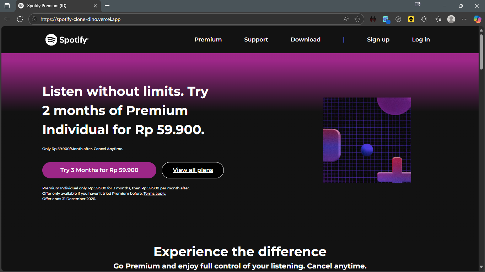
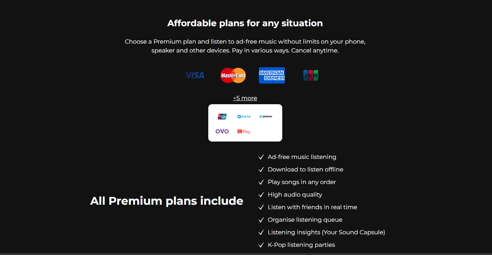
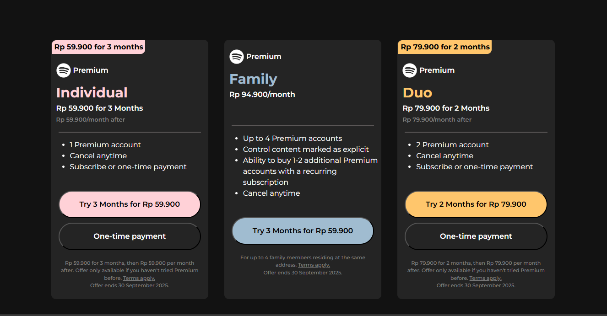
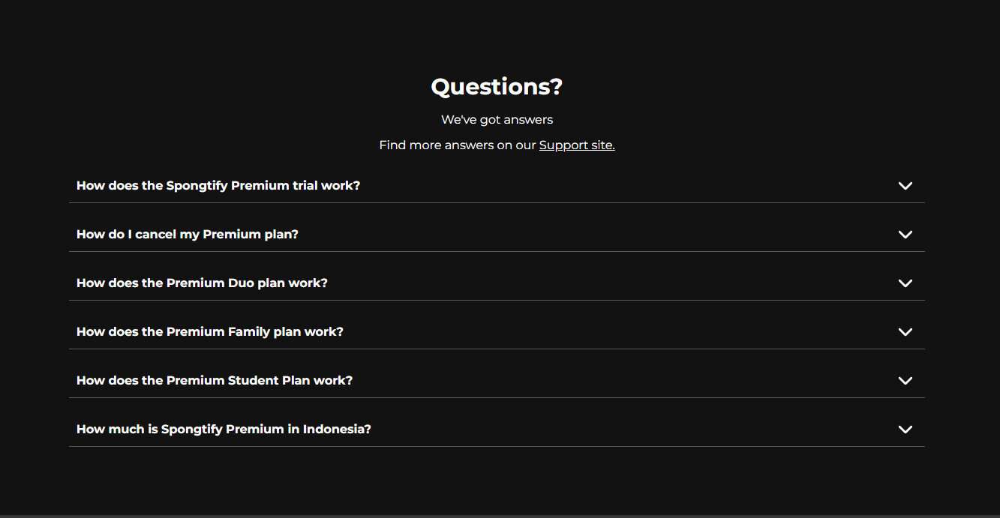
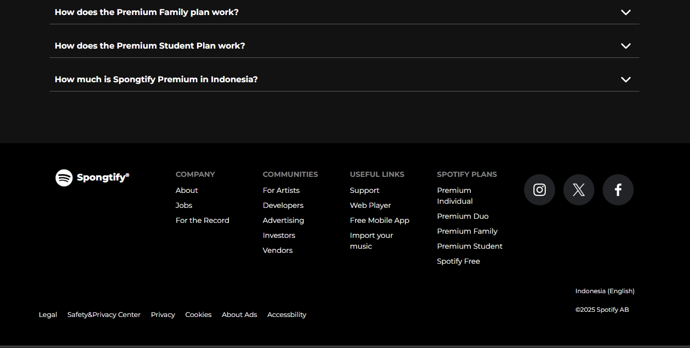

# 🎵 Spotify Landing Page Clone

Hello! This is my very first project.  
I tried to remake the landing page of Spotify’s website.  
This project was built basically **only with HTML5 and vanilla CSS3**. Some JavaScript was added to manipulating the DOM.  

Of course, there are some differences compared to the official Spotify website since their design has changed over time.  
I started this project on **September 2, 2025**. It’s still far from perfect, but it marks the beginning of my coding journey 🚀.

---

## 🚀 Live Demo
Check out the deployed project here: [Spotify Landing Page](https://spotify-clone-dino.vercel.app/)

---

## 📸 Preview
Here are some screenshots of the project:

### Hero Section

### Payment Method

### Premium Plans

### FAQ Section

### Footer Section

---

## 🛠️ Tech Stack
- **HTML5** (Semantic elements)  
- **CSS3** (Flexbox, Gradients, Table Styling)
- **JavaScript (vanilla)** — minimal DOM manipulation for small interactions / responsive tweaks

---

## 📚 What I Learned
- How to structure a webpage using semantic HTML5.  
- Using CSS3 for layout and styling (gradients, buttons, tables).  
- Basic DOM manipulation with vanilla JavaScript for interactive bits.  
- Make a static landing page responsive across common breakpoints (desktop → tablet → mobile).  
- How to deploy a static site to Vercel.

---

⚠️ Known limitations
- Some links are static (do not lead to other pages).
- Minor responsive edge cases may still exist on very small screens.
- No frameworks or build tools are used — intentionally kept simple for learning purposes.

---

## 📌 Next Steps 
Each project will gradually introduce more complexity — such as **responsiveness, JavaScript features, or even frameworks**.  
This way, you can see my **step-by-step learning journey**.  
